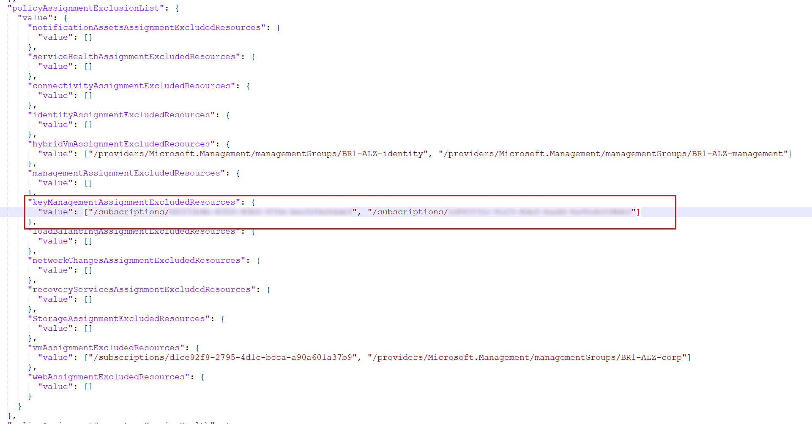

### In this page

> [Overview](../Exclude_resources_from_policy_assignment#overview)  
> [How this feature works](../Exclude_resources_from_policy_assignment#how-this-feature-works)  

## Overview

After release [2025-03-03](../Overview/Whats-New#2025-03-03) we have made available a new set of parameters that allows you do exclude Management Groups and/or Subscriptions from policy assignments. This feature helps customers that would like to control the application of policies at scale during the deployment of the AMBA-ALZ pattern. For brownfield customers, it is still possible to exclude resources from being assigned, but it has to be done manually at the assignment level. A guide to perform the task is availabel at the [Manually configure policy assignment exclusion]() page. For greenfield customers, it is possible to make use of the new parameters to add the resources to be excluded for each and every policy assignment. The resource format should follow the standar Azure resource id format reported below for both Managent Groups and Subscriptions:

- **Management Groups** == *"/providers/Microsoft.Management/managementGroups/<<management group id>>"*
- **Subscriptions** == *"/subscriptions/<<subscription id>>"*

The parameters can be configured with more than one value, since it is expecting an array of item, and with a mix of them. Below, you can find some use case with values to be passed for the exclusion:

### Exclusion of 2 management groups

"value": ["/providers/Microsoft.Management/managementGroups/mgmtGrp-1", "/providers/Microsoft.Management/managementGroups/mgmtGrp-2"]

  

### Exclusion of 2 subscriptions

"value": ["/subscriptions/00000000-0000-0000-0000-000000000000", "/subscriptions/11111111-1111-1111-1111-111111111111"]

### Exclusion of 1 management group and 1 subscription

"value": ["/providers/Microsoft.Management/managementGroups/mgmtGrp-1", "/subscriptions/11111111-1111-1111-1111-111111111111"]

### Exclusion of 2 management groups (or more) and 2 subscriptions (or more)

"value": ["/providers/Microsoft.Management/managementGroups/mgmtGrp-1", "/providers/Microsoft.Management/managementGroups/mgmtGrp-2", "/subscriptions/00000000-0000-0000-0000-000000000000", "/subscriptions/11111111-1111-1111-1111-111111111111"]

## How this feature works


**Configuration of exclusions at scale is not allowed while deploying through AMBA-ALZ Portal.**


The **Require a workspace linked storage** option in the query alert rule controls whether this scheduled query rule should be stored in the customer's storage. To control this option in the AMBA-ALZ pattern, we use the ***checkWorkspaceAlertsStorageConfigured*** parameter with a **default value of 'false'**. More information in the following article: [Scheduled Query Rules](https://learn.microsoft.com/en-us/azure/templates/microsoft.insights/scheduledqueryrules?pivots=deployment-language-bicep)

To change the **checkWorkspaceAlertsStorageConfigured** flag to **'true'**, navigate to:

- [alzArm.param.json](https://github.com/azure/azure-monitor-baseline-alerts/blob/2025-02-05/patterns/alz/alzArm.param.json) for the latest release.
- [alzArm.param.json](https://github.com/azure/azure-monitor-baseline-alerts/blob/main/patterns/alz/alzArm.param.json) for the main branch.
- change parameters value where name contains *checkWorkspaceAlertsStorageConfigured* to *true*
  


An alert rule won't be created if the Log Analytics workspace doesn't have a configured linked storage account.


Enabling this feature without a linked storage account, will cause the remediation task to fail

  

with an error message similar to the following one:

  

As consequence, <ins>***no alert rule for the given policy will be created***</ins> and the corresponding policy definition will show as ***Non-compliant***. See the image below

  
