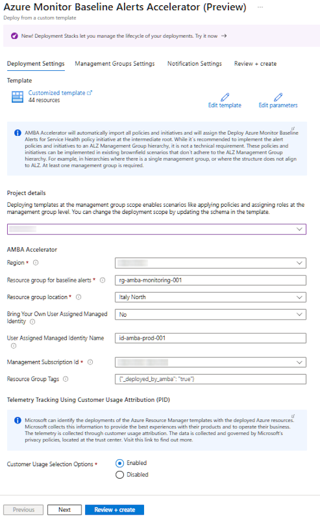

<<<<<<< HEAD:docs/content/patterns/alz/HowTo/deploy/Deploy-via-Azure-Portal-UI.md
</br>

=======
>>>>>>> 50e64f12830f19892cc6e813b50d9577e20035e7:docs/content/patterns/alz/deploy/Deploy-via-Azure-Portal-UI.md
[](https://aka.ms/amba/alz/portal)

</br>

## Deployment Settings Blade

<<<<<<< HEAD:docs/content/patterns/alz/HowTo/deploy/Deploy-via-Azure-Portal-UI.md


</br>
=======

>>>>>>> 50e64f12830f19892cc6e813b50d9577e20035e7:docs/content/patterns/alz/deploy/Deploy-via-Azure-Portal-UI.md

- Change the values on the Deployment Settings blade to the following instructions:
  - Choose the Management Group where you wish to deploy the policies and the initiatives, usually called the "pseudo root management group". For example, in [ALZ terminology](https://learn.microsoft.com/azure/cloud-adoption-framework/ready/landing-zone/design-area/resource-org-management-groups), this would be the "Intermediate Root Management Group" (directly beneath the "Tenant Root Group").
  - Choose the value of _`Region`_ to specify your Azure location of choice.
  - Change the value of _`Resource group for baseline alerts`_ to the name of the resource group where the activity logs, resource health alerts, actions groups and alert processing rules will be deployed in.
  - Choose the value of _`Resource group location`_ to specify the location for said resource group.
  - Choose the value of _`Bring Your Own User Assigned Managed Identity`_ to specify if you want to bring your own user assigned managed identity for monitoring purpose.
  - Define the value of _`User Assigned Managed Identity Name`_ to specify the name of the user assigned managed identity for monitoring purpose.
  - Choose the value of _`Bring Your Own User Assigned Managed Identity Resource Id`_ to specify the resource ID of the user assigned managed identity if you want to bring your own user assigned managed identity for monitoring purpose.
  - Choose the value of _`Management Subscription Id`_ to specify the subscription ID where the user assigned managed identity will be created.
  - Choose the value of _`Customer Usage Selection Option`_ Microsoft can identify the deployments of the Azure Resource Manager and Bicep templates with the deployed Azure resources. Microsoft can correlate these resources used to support the deployments. Microsoft collects this information to provide the best experiences with their products and to operate their business. The telemetry is collected through customer usage attribution. The data is collected and governed by Microsoft’s privacy policies, located at the trust center.
  - Change the value of _`Resource Group Tags`_ to specify the tags to be added to said resource group.

## Management Groups Settings Blade

- Change the values on the Management Groups Settings blade to the following instructions:

  

### If you are aligned to ALZ

<<<<<<< HEAD:docs/content/patterns/alz/HowTo/deploy/Deploy-via-Azure-Portal-UI.md
- Choose the value of _```Enterprise Scale Company Management Group```_ to the management group ID for Platform.
- Choose the value of _```Identity Management Group```_ to the management group ID for Identity.
- Choose the value of _```Management Management Group```_ to the management group ID for Management.
- Choose the value of _```Connectivity Management Group```_ to the management group ID for Connectivity.
- Choose the value of _```Landing Zone Management Group```_ to the management group ID for Landing Zones.
=======
- Choose the value of _`Enterprise Scale Company Management Group`_ to the management group ID for Platform.
- Choose the value of _`Identity Management Group`_ to the management group ID for Identity.
- Choose the value of _`Management Management Group`_ to the management groupID for Management.
- Choose the value of _`Connectivity Management Group`_ to the management group ID for Connectivity.
- Choose the value of _`Landing Zone Management Group`_ to the management group ID for Landing Zones.
>>>>>>> 50e64f12830f19892cc6e813b50d9577e20035e7:docs/content/patterns/alz/deploy/Deploy-via-Azure-Portal-UI.md

### If you are unaligned to ALZ

- Choose the value of _`Enterprise Scale Company Management Group`_ to the management group ID for Platform. The same management group ID may be repeated.
- Choose the value of _`Identity Management Group`_ to the management group ID for Identity. The same management group ID may be repeated.
- Choose the value of _`Management Management Group`_ to the management group ID for Management. The same management group ID may be repeated.
- Choose the value of _`Connectivity Management Group`_ to the management group ID for Connectivity. The same management group ID may be repeated.
- Choose the value of _`Landing Zone Management Group`_ to the management group ID for Landing Zones. The same management group ID may be repeated.


For ease of deployment and maintenance we have kept the same variables.


### If you have a single management group

- Choose the value of _`Enterprise Scale Company Management Group`_ to the pseudo root management group ID, also called the "Intermediate Root Management Group".
- Choose the value of _`Identity Management Group`_ to the pseudo root management group ID, also called the "Intermediate Root Management Group".
- Choose the value of _`Management Management Group`_ to the pseudo root management group ID, also called the "Intermediate Root Management Group".
- Choose the value of _`Connectivity Management Group`_ to the pseudo root management group ID, also called the "Intermediate Root Management Group".
- Choose the value of _`Landing Zone Management Group`_ to the pseudo root management group ID, also called the "Intermediate Root Management Group".


For ease of deployment and maintenance we have kept the same variables.


<<<<<<< HEAD:docs/content/patterns/alz/HowTo/deploy/Deploy-via-Azure-Portal-UI.md
- Set the value of _`Enable AMBA notification assets`_ to _`Yes`_. This configuration will deploy notification assets for Service Health alerts and broad notifications.
- Set the value of _`Enable AMBA Service Health`_ to _`Yes`_. This setting will assign the Service Health Policy Set Definition during deployment.
=======
- Change the value of _`Enable AMBA Hybrid VM`_ to _`Yes`_ This initiative deploys Azure Monitor Baseline Alerts to monitor Azure Arc-enabled Servers.
- Change the value of _`Enable AMBA Key Management`_ to _`Yes`_ This initiative deploys Azure Monitor Baseline Alerts to monitor Key Management Services such as Azure Key Vault, and Managed HSM.
- Change the value of _`Enable AMBA Load Balancing`_ to _`Yes`_ This initiative deploys Azure Monitor Baseline Alerts to monitor Load Balancing Services such as Load Balancer, Application Gateway, Traffic Manager, and Azure Front Door.
- Change the value of _`Enable AMBA Network Changes`_ to _`Yes`_ This initiative implements Azure Monitor Baseline Alerts to monitor alterations in Network Routing and Security, such as modifications to Route Tables and the removal of Network Security Groups.
- Change the value of _`Enable AMBA Recovery Services`_ to _`Yes`_ This initiative deploys Azure Monitor Baseline Alerts to monitor Recovery Services such as Azure Backup, and Azure Site Recovery.
- Change the value of _`Enable AMBA Storage`_ to _`Yes`_ This initiative deploys Azure Monitor Baseline Alerts to monitor Storage Services such as Storage accounts.
- Change the value of _`Enable AMBA VM`_ to _`Yes`_ This initiative deploys Azure Monitor Baseline Alerts to monitor Azure Virtual Machines.
- Change the value of _`Enable AMBA Web`_ to _`Yes`_ This initiative deploys Azure Monitor Baseline Alerts to monitor Web Services such as App Services.
- Set the value of _`Enable AMBA notification assets`_ to _`Yes`_. This configuration will deploy notification assets for Service Health alerts and broad notifications.
- Set the value of _`Enable AMBA Service Health`_ to _`Yes`_. This configuration will assign the Service Health Policy Set Definition during deployment.
>>>>>>> 50e64f12830f19892cc6e813b50d9577e20035e7:docs/content/patterns/alz/deploy/Deploy-via-Azure-Portal-UI.md

## Notification Settings Blade



While it's technically possible to not add any notification information (email, ARM Role, Logic App, etc.) it is highly recommended to configure at least one option.


- Change the values on the Notification Settings Blade to the following instructions:

  - Change the value of _`Bring Your Own Notifications (BYON)`_ to _`Yes`_ if you want to use existing Action Groups and Alert Processing Rules. The BYON feature allows you to set the necessary parameter values before deploying the ALZ pattern. You can either specify one or more existing Action Groups and one Alert Processing Rule, or provide target values so that the Action Group and Alert Processing Rule will be created using the actions specified in the parameter file. You may also leave the values blank, which will result in the creation of an empty Action Group.
  - Specify the email address(es) for _`Email contact for action group notifications`_ to receive notifications for alerts, including Service Health alerts. Leave this field blank if email notifications are not required.
  - Specify the URI(s) for _`Webhook Service Uri`_ to be used as actions for alerts, including Service Health alerts. Leave this field blank if no Webhook is used.
  - Select the Azure Resource Manager Role(s) for _`Arm Role ID`_ to receive notifications for alerts, including Service Health alerts. Leave this field blank if no Azure Resource Manager Role notification is required.
  - Specify the Logic app resource ID for _`Logicapp Resource ID`_ to be used as an action for alerts, including Service Health alerts. Leave this field blank if no Logic app is used.
  - Update the _`Logicapp Callback Url`_ with the callback URL of the Logic App you intend to use for alert actions (including Service Health alerts). If no Logic App is used, leave this field blank. To obtain the callback URL, you can either use the [_**Get-AzLogicAppTriggerCallbackUrl**_](https://learn.microsoft.com/powershell/module/az.logicapp/get-azlogicapptriggercallbackurl) PowerShell command or navigate to the Logic App in the Azure portal: go to _**Logic App Designer**_, expand the trigger activity (_When an HTTP request is received_), and copy the URL using the copy icon.

    

  - Specify the _`Event Hub Resource ID`_ for the Event Hubs to be used as actions for alerts, including Service Health alerts. Leave this field blank if no Event Hubs are used.
  - Specify the _`Function Resource ID`_ for the Function App to be used as an action for alerts, including Service Health alerts. Leave this field blank if no Function App is used.
  - Update the _`Function Trigger Url`_ with the trigger URL of the Function App to be used as an action for alerts, including Service Health alerts. Leave this field blank if no Function App is used. To obtain the Function App trigger URL with the corresponding code, navigate to the HTTP-triggered functions in the Azure portal, go to _**Code + Test**_, select **Get function URL** from the top menu, and copy the value in the URL field using the copy icon.

    

<<<<<<< HEAD:docs/content/patterns/alz/HowTo/deploy/Deploy-via-Azure-Portal-UI.md
    
    It is possible use multiple email addresses, Arm Roles, Webhooks or Event Hubs (not recommended as per ALZ guidance).
    Should you set multiple entries, ensure that they are entered as a single string with values separated by comma. Example:

    - action1@contoso.com , action2@contoso.com , action3@contoso.com
    - https://webhookUri1.webhook.com, http://webhookUri2.webhook.com
    

=======
  
  It is possible use multiple email addresses, Arm Roles, Webhooks or Event Hubs (not recommended as per ALZ guidance). Should you set multiple entries, ensure that they are entered as an array. Example:

  `["action1@contoso.com","action2@contoso.com","action3@contoso.com"]`

  `["https://webhookUri1.webhook.com","http://webhookUri2.webhook.com"]`

  

>>>>>>> 50e64f12830f19892cc6e813b50d9577e20035e7:docs/content/patterns/alz/deploy/Deploy-via-Azure-Portal-UI.md
## Next steps

To remediate non-compliant policies, continue with [Policy remediation](../Remediate-Policies)

[Back to top of page](.)
