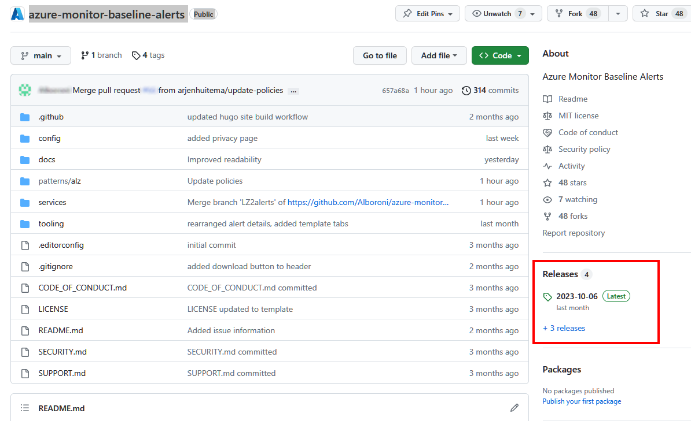
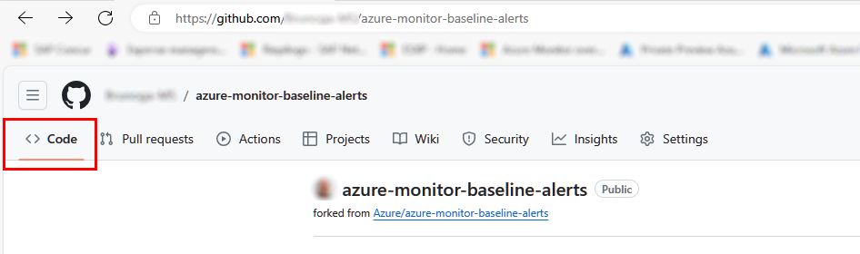
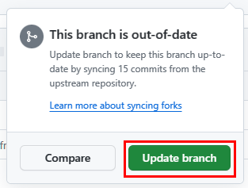
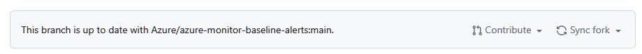
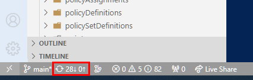
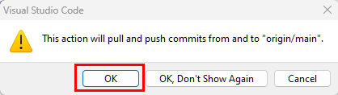
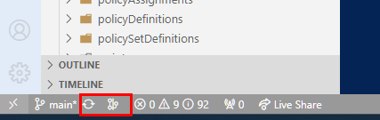
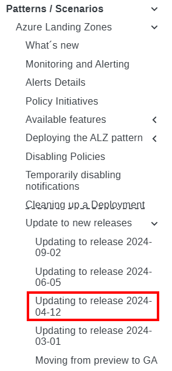

## What is included in the latest release

The list of enhancement, additions and fixed bugs contained in every release can be seen by navigating to corresponding page linked in the home page of the [azure-monitor-baseline-alerts](https://github.com/Azure/azure-monitor-baseline-alerts) repository.

On the center-right side of the page, there's a specific section indicating the latest release. Click on the release number to see the release content.

 

## Steps to update to the latest release

This section will guide you through the necessary steps to update the current deployment with the latest enhancements contained in the latest release. Guidance on updating to releases containing breaking changes is not in scope and could eventually be described in a dedicated page.


This scenario only applies to AMBA deployments performed using GitHub. If not using GitHub, please refer to the [Can I use AMBA without a GitHub repository](../FAQ/#can-i-use-amba-without-a-github-repository) scenario documented in the *Frequently Asked Questions* making sure you update the template spec as required.


Depending if you used the official code from the official GitHub repository or from a forked one, not all the high-level steps below are required:

1. Sync your fork *(only required if you forked the original repo)*
2. Update your local copy of the repo *(only required if you cloned your fork on your local hard drive)*
3. Check for specific requirements when updating to a newer release ***(always required)***
4. Update the parameter file with any new parameter and configuration
5. Deploy ***(always required)***
6. Start the policy remediation ***(always required)***

### Sync your fork (only required if you forked the original repo)

Synching a fork means that we're making sure any update made to the main branch in the official repo is replicated over yours. To sync your fork:

1. Open your GitHub repo page. If you don't remember the URL, consider that it normally looks like `https://github.com/***<YourGitHubId>***/azure-monitor-baseline-alerts`.
2. You should be redirected to the default page, which is **<> Code**. If not, click on the **<> Code** tab.

    

3. Click on the **Sync fork** and then select **Update branch**

    

4. Refresh the page and make sure to see the description reported in the picture below on the left of the **Contribute** and **Sync fork** buttons

    

 

### Update your local copy (only required if you cloned your fork on your local hard drive)

Within the code editor of your choice, make sure you pull the changes from your remote fork. Pulling changes from origin/main is necessary to ensure that the local branch is exactly the same as the remote. In this guide, we will use VS Code.

1. Open VS Code and open the folder containing the cloned repo.
2. In the bottom-left corner click on the pull icon

    

3. Confirm or approve the operation if necessary

    

4. Ensure there are no issues with pulling changes and that the numbers close to the icon in the bottom-left corner are both **0** or not showing at all

    

 

### Check for detailed requirement when updating to a newer release (always required)

Check the content of the page corresponding to the release you are updating to, to see if there's any pre or post deployment action required. For instance, if you're updating to release **2024-04-12**, check the page called ***Updating to release 2024-04-12***

  

### Update the parameter file with any new parameter and configuration

The parameter may undergo changes in the structure or in the number of parameters that need to be configured.
For this reason, based on what documented in the [What's new](../Whats-New.md) or in the [Releases](https://github.com/Azure/azure-monitor-baseline-alerts/releases) pages. For this reason it mandatory that you check your current parameter file content with the one coming with the release, making sure you with new or refactored parameters.

### Deploy (always required)

Once you reached this stage, you are ready to deploy the latest release. You can deploy using a method of your choice among the allowed one:

- To deploy with GitHub Actions, please proceed with [Deploy with GitHub Actions](../deploy/Deploy-with-GitHub-Actions)
- To deploy with Azure Pipelines, please proceed with [Deploy with Azure Pipelines](../deploy/Deploy-with-Azure-Pipelines)
- To deploy with Azure CLI, please proceed with [Deploy with Azure CLI](../deploy/Deploy-with-Azure-CLI)
- To deploy with Azure PowerShell, please proceed with [Deploy with Azure PowerShell](../deploy/Deploy-with-Azure-PowerShell)

### Start the policy remediation (always required)

To remediate non-compliant policies, continue with Policy remediation documented at [Remediate Policies](../deploy/Remediate-Policies)
