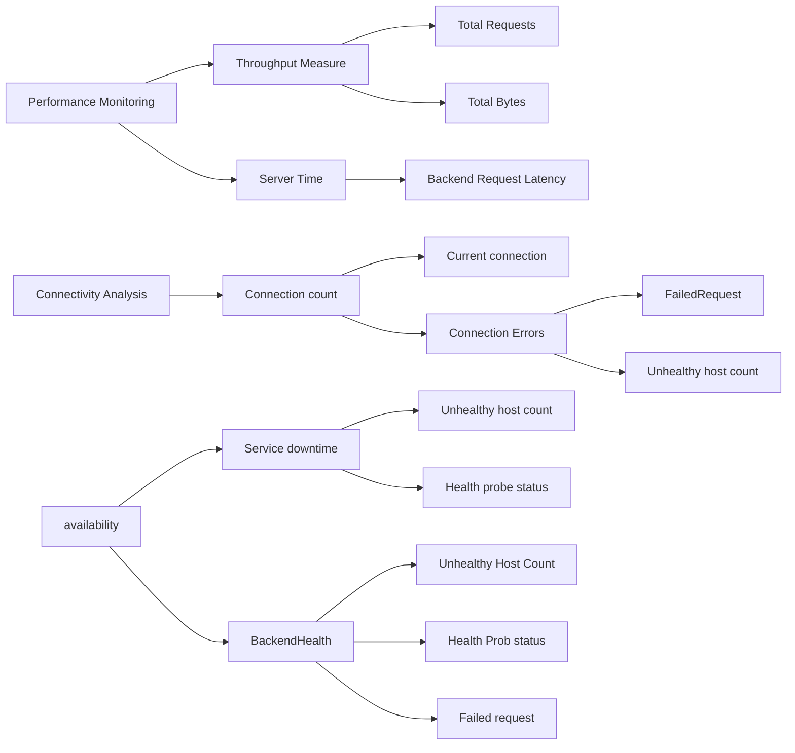

Azure application gateway monitoring.
Application gateways provide connectivity via TCP layer seven to backend application represented by listener inside application gateway. Each listener represents one unit of business application and hence it is important to isolate each listener when monitoring back-end application.  Backend monitoring can be filter by the dimension of listener to isolate telemetry of backend application.
For the gateway, common use cases are monitoring for availability, performance, and monitoring connectivity.

Gateway monitoring reference [page](https://learn.microsoft.com/azure/application-gateway/monitor-application-gateway-reference) highlight which metric to use for back end and /or gateway monitoring.

For application gateway, monitoring is utilized for understanding availability, performance and connectivity of gateway.

Availability can be monitor by analyzing uptime and downtime. Unhealthy host counts, health probe status of the backend pool reports on availability of back end. Failed request count and measuring it over time can also be used for reporting availability.

Application gateway provide serval metrics for measuring performance of backend and application gateway, the detail of which is published here in this [doc](https://learn.microsoft.com/azure/application-gateway/application-gateway-metrics). Carefully analyze front end response and back end response to understand and analyze root cause of performance.


{{ if .Store.Get "hasMermaid" }}
  
{{ end }}
