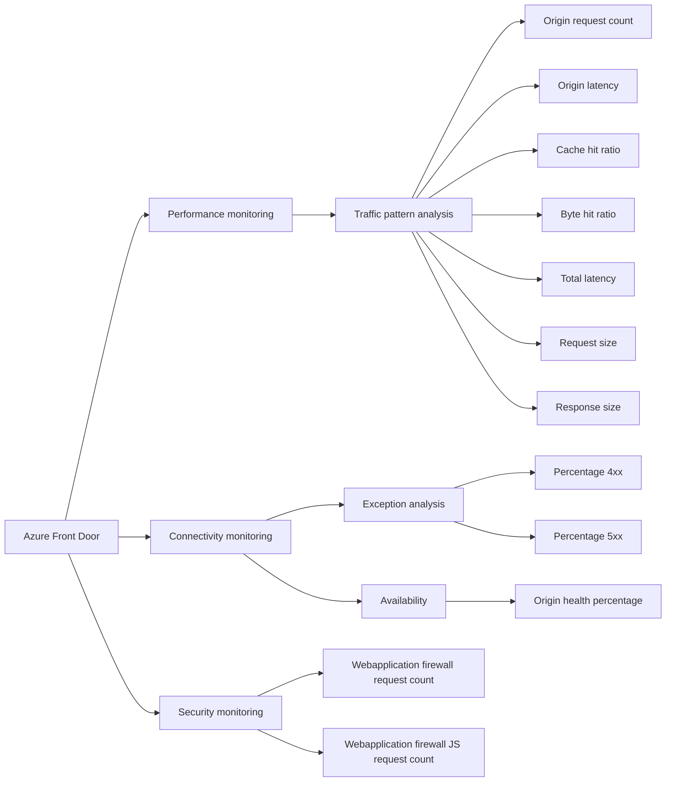

Azure Front Door comes with pre-configured reports. It’s essential to review and utilize these built-in reports whenever possible before you consider developing custom reports.

Below is a list of reports detailing their usage and scenarios:

1. [Traffic by domain](https://learn.microsoft.com/azure/frontdoor/standard-premium/how-to-reports?tabs=traffic-by-domain#traffic-by-domain-report)
2. [Traffic by location](https://learn.microsoft.com/azure/frontdoor/standard-premium/how-to-reports?tabs=traffic-by-domain#traffic-by-location-report)
3. [Usage report](https://learn.microsoft.com/azure/frontdoor/standard-premium/how-to-reports?tabs=traffic-by-domain#usage-report)
4. [Caching report](https://learn.microsoft.com/azure/frontdoor/standard-premium/how-to-reports?tabs=traffic-by-domain#caching-report)
5. [Top url report](https://learn.microsoft.com/azure/frontdoor/standard-premium/how-to-reports?tabs=traffic-by-domain#top-url-report)
6. [Top referrer report](https://learn.microsoft.com/azure/frontdoor/standard-premium/how-to-reports?tabs=traffic-by-domain#top-referrer-report)
7. [Top user agent report](https://learn.microsoft.com/azure/frontdoor/standard-premium/how-to-reports?tabs=topuser-agent#top-user-agent-report)

Each report contains the following key metrics which are helpful in determining performance and availability of Azure Front Door and origin. An origin refers to the application deployment from which Azure Front Door retrieves content when caching isn’t enabled or when a cache miss occurs. It supports origins hosted in Azure, as well as applications hosted in your on-premises datacenter or with another cloud provider. The origin is essentially the endpoint for your application backend.

List of key metrics available in  Azure Front Door reports.
- Peak Bandwidth.  
- Requests.  
- Cache Hit Ratio.  
- Total Latency.  
- 5XX Error Rate.  

To check availability, look at the 5xx Error Rate metric to see which origin is failing to handle requests.

To understand availability in detail, calculate the 5XX errors Rate as a percentage of total requests. This will show you the rate of failed requests and indicate which origin or backend needs more troubleshooting.

 4xx Error Rate also affects the web application’s availability. Therefore, examining the 4xx Error Rate metrics can help you understand and improve backend availability.

Azure Front Door also integrate with Azure Monitor, and it is important to create [alert](https://learn.microsoft.com/azure/frontdoor/standard-premium/how-to-monitor-metrics) based on key threshold for availability and performance such as 4XX Error Rate or 5XX Error Rate.

This workflow chart will guide you in choosing the right key metrics for different scenarios.


{{ if .Store.Get "hasMermaid" }}
  
{{ end }}
