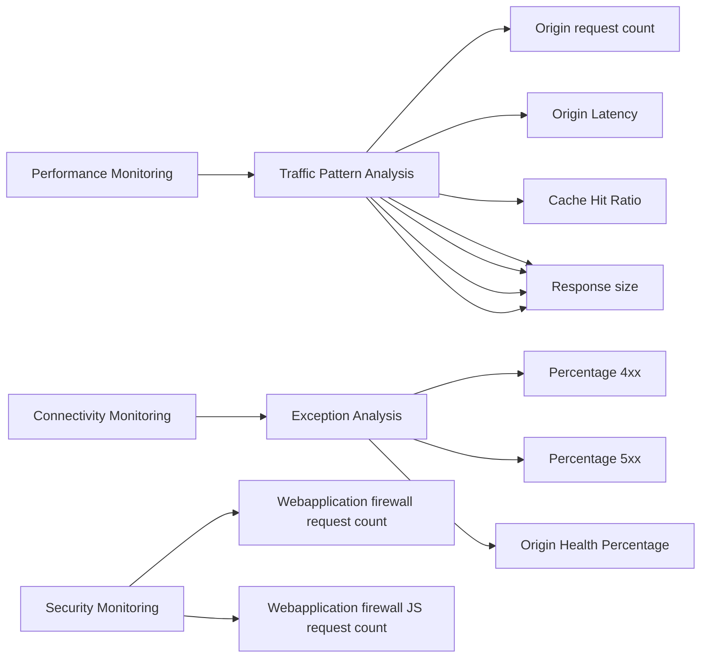

Azure front door includes a number of built in reports and hence its important to check the built-in report in Azure front door.

Azure front door report list and usage scenario:
1. [Traffic by domain](https://learn.microsoft.com/azure/frontdoor/standard-premium/how-to-reports?tabs=traffic-by-domain#traffic-by-domain-report)
2. [Traffic by location](https://learn.microsoft.com/azure/frontdoor/standard-premium/how-to-reports?tabs=traffic-by-domain#traffic-by-location-report)
3. [Usage report](https://learn.microsoft.com/azure/frontdoor/standard-premium/how-to-reports?tabs=traffic-by-domain#usage-report)
4. [Caching report](https://learn.microsoft.com/azure/frontdoor/standard-premium/how-to-reports?tabs=traffic-by-domain#caching-report)
5. [Top URL report](https://learn.microsoft.com/azure/frontdoor/standard-premium/how-to-reports?tabs=traffic-by-domain#top-url-report)
6. [Top referrer report](https://learn.microsoft.com/azure/frontdoor/standard-premium/how-to-reports?tabs=traffic-by-domain#top-referrer-report)
7. [Top user agent report](https://learn.microsoft.com/azure/frontdoor/standard-premium/how-to-reports?tabs=traffic-by-domain#top-user-agent-report)

Every report contains the following key metrics
Peak bandwidth
Requests
Cache hit ratio
Total latency
5XX error rate

For availability total number of 5xx error rate would identify backend dropping request. Carefully analyze the percentage of 5XX over total request to get the percentage of request which had error. In Addition to 5xx, 4xx error rate also contribute to the unavailability of web application and hence analyze 4xx metrics for backend availability and error rate.

Azure front door also integrate with Azure monitor and its important to create [alert](https://learn.microsoft.com/azure/frontdoor/standard-premium/how-to-monitor-metrics) based on key threshold for availability and performance such as 4XXErrorRate or 5XXErrorRate


