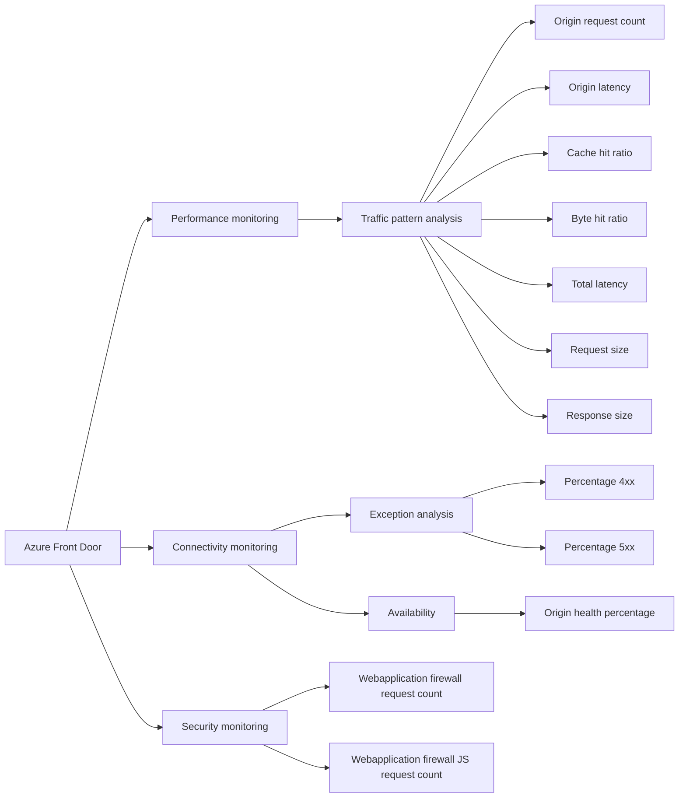

Azure Front Door includes built in reports and hence its important to check built-in report for Azure Front Door and use them where it’s possible before creating any custom reports.

Below are some of the reports with the list of usage and scenario:

1. [Traffic by domain](https://learn.microsoft.com/azure/frontdoor/standard-premium/how-to-reports?tabs=traffic-by-domain#traffic-by-domain-report)
2. [Traffic by location](https://learn.microsoft.com/azure/frontdoor/standard-premium/how-to-reports?tabs=traffic-by-domain#traffic-by-location-report)
3. [Usage report](https://learn.microsoft.com/azure/frontdoor/standard-premium/how-to-reports?tabs=traffic-by-domain#usage-report)
4. [Caching report](https://learn.microsoft.com/azure/frontdoor/standard-premium/how-to-reports?tabs=traffic-by-domain#caching-report)
5. [Top url report](https://learn.microsoft.com/azure/frontdoor/standard-premium/how-to-reports?tabs=traffic-by-domain#top-url-report)
6. [Top referrer report](https://learn.microsoft.com/azure/frontdoor/standard-premium/how-to-reports?tabs=traffic-by-domain#top-referrer-report)
7. [Top user agent report](https://learn.microsoft.com/azure/frontdoor/standard-premium/)

Each report contains the following key metrics which are helpful in determining performance and availability of Azure Front Door and origin.

Peak bandwidth.  
Requests.  
Cache hit ratio.  
Total latency.  
5XX error rate.  

For availability total number of 5xx error rate would identify origin which is dropping requests. For detailed availability, analyze percentage of 5XX over total request to get the percentage of request and it will give you which origin or back-end requires further troubleshooting. In addition to 5xx, 4xx error rate also contributes to unavailability of web application and hence analyze 4xx metrics further aide in analyzing back-end availability.
Azure Front Door also integrate with Azure monitor, and it is important to create [alert](https://learn.microsoft.com/azure/frontdoor/standard-premium/how-to-monitor-metrics) based on key threshold for availability and performance such as 4XXErrorRate or 5XXErrorRate.
The following workflow chart will also help in the selection of key metrics for each use case.


{{ if .Store.Get "hasMermaid" }}
  
{{ end }}
