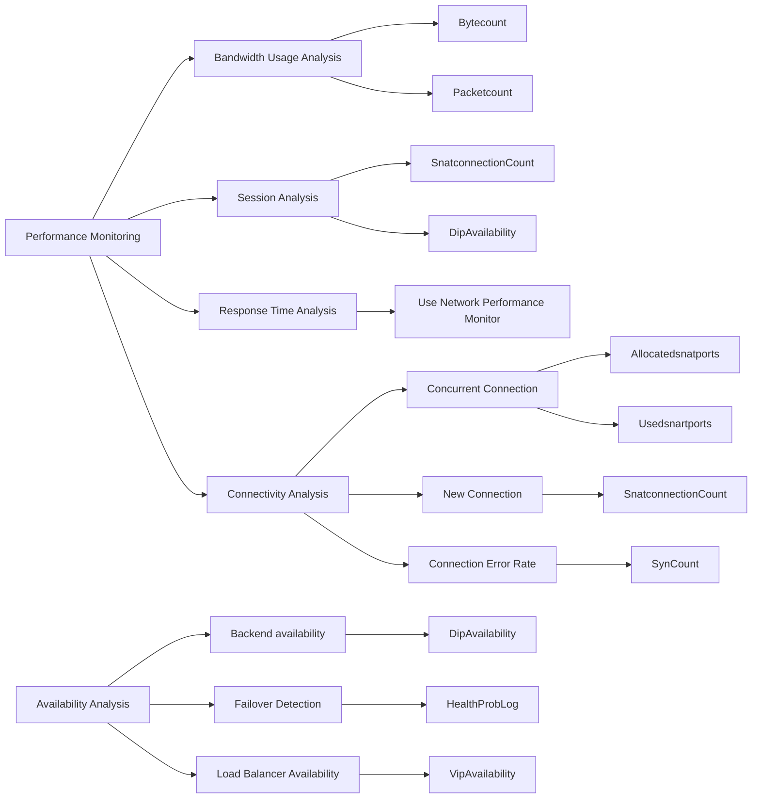

Load Balancer Monitoring Design

Load balancer(Internal & external ) in Azure distribute traffic to the backend applications and hence when it come to monitoring there are multiple use cases for monitoring. Usually the intent of monitoring is either to monitor application or the availability of the load balancer. Load balancer is exposed internally & externally and therefore data path availability is another dimension which may requires monitoring. Telemetry from session analysis, response time analysis and connectivity analysis aid in analyzing root cause of performance issue of a load balancer and underlying application.

We could look in detail into snat port exhausting or port already in used When load balancer is not responding or accepting new connection to see and understand the pattern of traffic.

the following diagram explains some of the most common scenario and use cases for load balancer monitoring.



{{ if .Store.Get "hasMermaid" }}
  
{{ end }}
